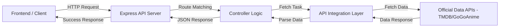

# ⚡ AniStream: Advanced Anime Discovery & Streaming Platform ⚡


## 🚀 Project Overview

**AniStream** is a comprehensive full-stack application designed to provide a centralized interface for anime discovery and streaming. It integrates with industry-standard APIs—**TMDB** for rich metadata and the **GoGoAnime API** for streaming resources—to offer a clean RESTful experience and a modern, responsive frontend.

This project was developed for a **College Project Presentation**, focusing on distributed systems, real-time data orchestration, and modern web architecture.

### ✨ Key Features
- **Real-time Data Fetching**: Retrieves the latest anime updates, trending shows, and high-quality streaming links directly from official APIs without local database dependency.
- **API Integrations**: Seamlessly integrates with **TMDB** (The Movie Database) for accurate anime details, posters, and ratings, while leveraging the **GoGoAnime API** for reliable streaming link delivery.
- **Secure HLS Extraction**: Implements custom decryption logic to retrieve direct `.m3u8` streaming links with subtitle support.
- **RESTful API Architecture**: Clean, documented endpoints for search, info retrieval, and streaming sources.
- **Modern UI**: A premium, glassmorphism-inspired frontend built for both desktop and mobile devices.

---

## 🛠️ Technology Stack

| Component | Technologies Used |
| :--- | :--- |
| **Backend** | Node.js, Express.js, TypeScript |
| **Data Aggregation** | Axios, Response Parsing (Cheerio) |
| **Security** | Crypto-JS (HLS Key Decryption) |
| **Frontend** | HTML5, Modern CSS (Glassmorphism), Vanilla JavaScript |
| **Deployment** | Vercel, Docker |
| **Utilities** | Dotenv, Express-rate-limit, Nodemon |

---

## 📐 System Architecture

The following diagram illustrates the request-response flow of the AniStream system:



---

## 📂 Project Structure

```text
├── api/                # Vercel serverless functions
├── public/             # Frontend assets (HTML, CSS, JS)
├── src/
│   ├── controllers/    # Request handling logic
│   ├── fetchers/       # Source-specific integration logic
│   ├── extracters/     # Stream link decryption logic
│   ├── routes/         # API endpoint definitions
│   ├── lib/            # Shared libraries
│   ├── utils/          # Helper functions
│   ├── types/          # TypeScript definitions
│   └── server.ts       # Application entry point
├── build/              # Compiled JavaScript files
└── Dockerfile          # Containerization config
```

---

## 📥 Installation & Setup

### Prerequisites
- [Node.js](https://nodejs.org/) (v18 or higher)
- [npm](https://www.npmjs.com/) or [Bun](https://bun.sh/)

### Local Development
1. **Clone the repository**:
   ```bash
   git clone https://github.com/yourusername/anime-api.git
   cd anime-api
   ```

2. **Install dependencies**:
   ```bash
   npm install
   ```

3. **Run in development mode**:
   ```bash
   npm run dev
   ```
   The API will be available at `http://localhost:4000`.

4. **Build for production**:
   ```bash
   npm run build
   npm start
   ```

---

## 📖 API Documentation

The API is powered by high-authority data sources to ensure accuracy and performance. All responses are returned in JSON format.

### 🔹 Metadata & Discovery (Powered by TMDB)
- `GET /aniwatch/` - Get Home Page (Spotlight, Trending, etc.)
- `GET /aniwatch/anime/:id` - Get detailed metadata for a specific anime.
- `GET /aniwatch/search?keyword={query}&page={n}` - Search for anime via TMDB index.
- `GET /aniwatch/episodes/:id` - List all available episodes.

### 🔹 Streaming Resources (Powered by GoGoAnime API)
- `GET /aniwatch/servers?id={epId}` - Get available streaming servers.
- `GET /aniwatch/episode-srcs?id={epId}&server={name}` - Get direct HLS source links.
- `GET /gogoanime/recent-releases?page={n}` - Latest streaming updates.
- `GET /gogoanime/new-seasons?page={n}` - Trending new seasons.
- `GET /gogoanime/popular?page={n}` - Most popular anime resources.
- `GET /gogoanime/anime-movies?page={n}` - List of anime movie resources.


---

## 🔮 Future Enhancements
- [ ] **Multi-Provider Search**: Search across all supported websites simultaneously.
- [ ] **User Accounts**: Cloud-synced watchlists and history using Firebase.
- [ ] **Desktop App**: Native desktop client using Electron.
- [ ] **Advanced Filtering**: Filter by genre, year, status, and rating.

---

## 🤝 Acknowledgments
- [TMDB API](https://www.themoviedb.org/documentation/api) for high-quality metadata.
- The Anime Community for providing reliable content sources.

---

## 📜 License
This project is licensed under the **ISC License**. See the [LICENSE](LICENSE) file for details.

---
<p align="center">Made with ❤️ by AMBESH SINGH for the Anime Community</p>
