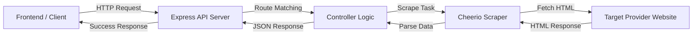

# ⚡ AniStream: Advanced Anime Scraper & Streaming Platform ⚡

<p align="center">
  
</p>

<p align="center">
  
  <br/>
  <b>A high-performance, real-time web scraping API and frontend for seamless anime streaming.</b>
  <br/>
  <a href="https://api-anime-rouge.vercel.app"><kbd>Live Demo: api-anime-rouge.vercel.app</kbd></a>
</p>

---

## 🚀 Project Overview

**AniStream** is a comprehensive full-stack application designed to provide a centralized interface for anime discovery and streaming. It leverages advanced web scraping techniques to aggregate content from multiple reliable providers, offering a clean RESTful API and a modern, responsive frontend.

This project was developed for a **College Project Presentation**, focusing on distributed systems, real-time data extraction, and modern web architecture.

### ✨ Key Features
- **Real-time Data Extraction**: Scrapes the latest anime updates, trending shows, and streaming links directly from providers without local database dependency.
- **Provider Support**: Currently supports **AniWatch** and **GoGoAnime**, with an extensible architecture for future integrations.
- **Secure HLS Extraction**: Implements custom decryption logic to retrieve direct `.m3u8` streaming links with subtitle support.
- **RESTful API Architecture**: Clean, documented endpoints for search, info retrieval, and streaming sources.
- **Modern UI**: A premium, glassmorphism-inspired frontend built for both desktop and mobile devices.

---

## 🛠️ Technology Stack

| Component | Technologies Used |
| :--- | :--- |
| **Backend** | Node.js, Express.js, TypeScript |
| **Scraping** | Axios, Cheerio (DOM Parsing) |
| **Security** | Crypto-JS (HLS Key Decryption) |
| **Frontend** | HTML5, Modern CSS (Glassmorphism), Vanilla JavaScript |
| **Deployment** | Vercel, Docker |
| **Utilities** | Dotenv, Express-rate-limit, Nodemon |

---

## 📐 System Architecture

The following diagram illustrates the request-response flow of the AniStream system:



---

## 📂 Project Structure

```text
├── api/                # Vercel serverless functions
├── public/             # Frontend assets (HTML, CSS, JS)
├── src/
│   ├── controllers/    # Request handling logic
│   ├── scrapers/       # Website-specific scraping logic
│   ├── extracters/     # Stream link decryption logic
│   ├── routes/         # API endpoint definitions
│   ├── lib/            # Shared libraries
│   ├── utils/          # Helper functions
│   ├── types/          # TypeScript definitions
│   └── server.ts       # Application entry point
├── build/              # Compiled JavaScript files
└── Dockerfile          # Containerization config
```

---

## 📥 Installation & Setup

### Prerequisites
- [Node.js](https://nodejs.org/) (v18 or higher)
- [npm](https://www.npmjs.com/) or [Bun](https://bun.sh/)

### Local Development
1. **Clone the repository**:
   ```bash
   git clone https://github.com/yourusername/anime-api.git
   cd anime-api
   ```

2. **Install dependencies**:
   ```bash
   npm install
   ```

3. **Run in development mode**:
   ```bash
   npm run dev
   ```
   The API will be available at `http://localhost:4000`.

4. **Build for production**:
   ```bash
   npm run build
   npm start
   ```

---

## 📖 API Documentation

The API is divided into provider-specific namespaces. All responses are returned in JSON format.

### 🔹 AniWatch Endpoints
- `GET /aniwatch/` - Get Home Page (Spotlight, Trending, etc.)
- `GET /aniwatch/anime/:id` - Get detailed info for a specific anime.
- `GET /aniwatch/search?keyword={query}&page={n}` - Search for anime.
- `GET /aniwatch/episodes/:id` - List all episodes for an anime.
- `GET /aniwatch/servers?id={epId}` - Get available streaming servers.
- `GET /aniwatch/episode-srcs?id={epId}&server={name}` - Get direct HLS source links.

### 🔹 GoGoAnime Endpoints
- `GET /gogoanime/recent-releases?page={n}` - Latest sub/dub releases.
- `GET /gogoanime/new-seasons?page={n}` - Trending new seasons.
- `GET /gogoanime/popular?page={n}` - Most popular anime.
- `GET /gogoanime/anime-movies?page={n}` - List of anime movies.

> [!TIP]
> For a detailed breakdown of response schemas, refer to the [Legacy Documentation](README_LEGACY.md) or test the live endpoints.

---

## 🔮 Future Enhancements
- [ ] **Multi-Provider Search**: Search across all supported websites simultaneously.
- [ ] **User Accounts**: Cloud-synced watchlists and history using Firebase.
- [ ] **Desktop App**: Native desktop client using Electron.
- [ ] **Advanced Filtering**: Filter by genre, year, status, and rating.

---

## 🤝 Acknowledgments
- [Consumet](https://github.com/consumet/consumet.ts) for inspiration and initial logic.
- The Anime Community for providing reliable content sources.

---

## 📜 License
This project is licensed under the **ISC License**. See the [LICENSE](LICENSE) file for details.

---
<p align="center">Made with ❤️ for the Anime Community</p>
